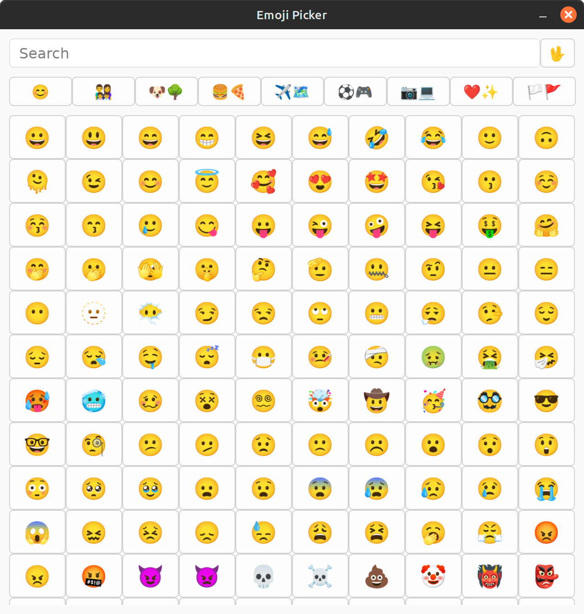
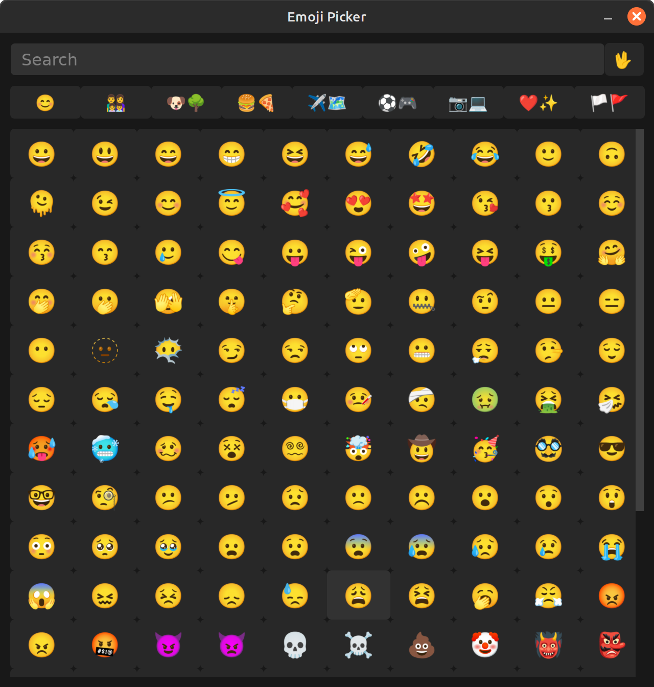

# 😀 Emoji Picker

The 9000th implementation of an emoji picker. This one is a standalone app built with Rust and [Vizia](https://github.com/vizia/vizia). It uses the [Noto Color Emoji Font](https://fonts.google.com/noto/specimen/Noto+Color+Emoji).

Light theme             |  Dark theme
:-------------------------:|:-------------------------:
 | 

## 🎮 Usage

Just compile and run the code. It will open a window with a list of emojis. Click on an emoji to copy it to the clipboard. You can also search for emojis by typing in the search bar.

## 🎉 Features

- [x] Search 🔍
- [x] Copy to clipboard 📋
- [x] Skin tone selection 🖖
- [x] System theme support 🌓 (can be changed with --theme argument)

## 🚀 Development

```bash
cargo run --release
```